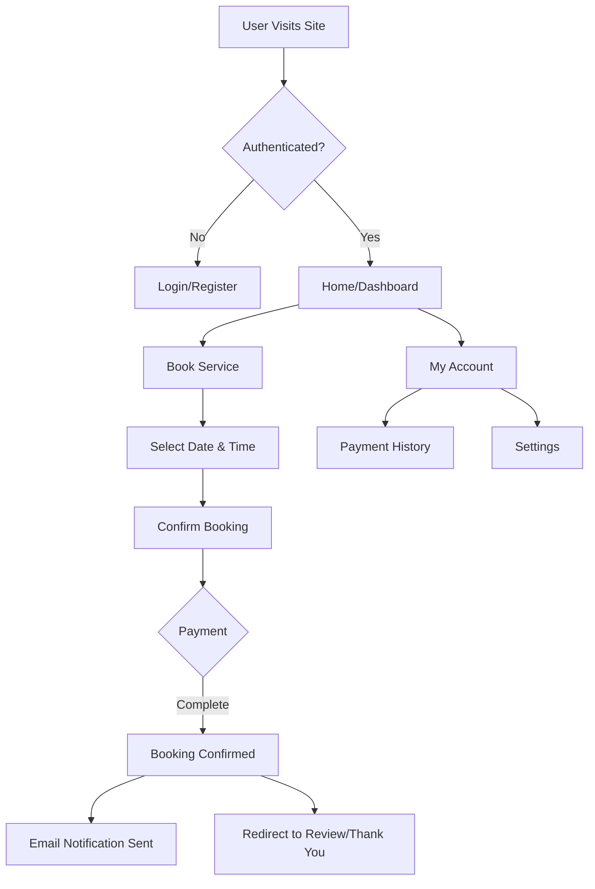

# 🌿 Akshata Beauty Herbal Parlour

A modern, full-stack appointment booking system designed for **Akshata Beauty Herbal Parlour**. This application provides a seamless experience for customers to book services and for the business to manage appointments, payments, and reviews.

**🚀 Live Demo:** [https://akshata-herbal-beauty.vercel.app](https://akshata-herbal-beauty.vercel.app)

---

## ✨ Key Features

### 👤 User Experience
*   **Seamless Booking Flow**: Easy-to-use interface for selecting services, dates, and times.
*   **User Accounts**: Secure login, registration, and password recovery via email.
*   **Dashboard**: Personal user dashboard to view booking history and manage profile settings.
*   **Payment History**: sophisticated tracking of past payments with downloadable PDF receipts.
*   **Review System**: Customers can write, edit, and view reviews with a star rating system.
*   **Dark Mode**: Fully supported system-wide dark mode for better visual comfort.

### 🛠️ Functionality & Backend
*   **Real-time Notifications**: Integrated Email (Web3Forms) and internal notification logic for appointments.
*   **Contact Form**: Functional "Send Us a Message" form with spam protection and email delivery.
*   **Admin Dashboard**: Dedicated area for the business owner to view bookings, manage services, and configure business settings.
*   **Business Settings**: Configurable options for email notifications and operational preferences.

### ⚡ Performance & Optimization
*   **Lazy Loading**: Route-based code splitting to ensure lightning-fast initial load times.
*   **Optimized Assets**: Compressed media and efficient bundle splitting for Vercel deployment.
*   **Responsive Design**: Mobile-first architecture ensuring perfect rendering on all devices.

---

## 🏗 Project Architecture

### 📊 User Flow


---

## ⚙️ Technology Stack

*   **Frontend**: React 18, TypeScript, Vite
*   **Styling**: Tailwind CSS, PostCSS
*   **Icons**: Lucide React
*   **State Management**: React Hooks & Context API
*   **Email Services**: Web3Forms, EmailJS (Fallback)
*   **Deployment**: Vercel

---

## 🚀 Getting Started

### Prerequisites
*   Node.js (v18 or higher)
*   npm or yarn

### Installation

1.  **Clone the repository**
    ```bash
    git clone https://github.com/abhishekdev-ap/Akshata-beauty-herbal-project.git
    cd Akshata-beauty-herbal-project
    ```

2.  **Install dependencies**
    ```bash
    npm install
    ```

3.  **Run the development server**
    ```bash
    npm run dev
    ```

### Deployment

This project is optimized for deployment on **Vercel**.

1.  Build the project:
    ```bash
    npm run build
    ```
2.  Deploy:
    ```bash
    npx vercel --prod
    ```

---

## 🔒 License

This project is proprietary software developed for **Akshata Beauty Herbal Parlour**. All rights reserved.
