# 🌿 Akshata Beauty Herbal Parlour

A modern, full-stack appointment booking system designed for **Akshata Beauty Herbal Parlour**. This application transforms a traditional salon business into a digital SaaS platform, offering seamless booking for customers and powerful management tools for the owner.

**🚀 Live Demo:** [https://akshata-beauty-world.vercel.app](https://akshata-beauty-world.vercel.app)

**📅 Last Updated:** January 2026

---

## ✨ Key Features

### 💳 Smart Payments
- **Direct UPI Integration**: Pay using **Google Pay**, **PhonePe**, or any UPI app directly from mobile browser
- **Animated Payment Success**: Beautiful green checkmark animation after payment completion
- **Razorpay Integration**: Secure card/netbanking payments
- **Deep Linking**: Automatically opens payment apps on mobile devices
- **Payment Confirmation**: Secure checkbox confirmation before booking
- **Zero-Commission UPI**: Direct bank-to-bank transfer without gateway fees

### 📍 Location & Contact
- **Interactive Location Card**: Clickable card opens **exact street view** in Google Maps
- **Smart Contact Form**: Integrated with **Web3Forms** for reliable email delivery
- **Real-time Availability**: Status indicator shows if parlour is open/closed

### 👤 Customer Experience
- **Seamless Booking**: Intuitive flow for selecting services, dates, and time slots
- **User Dashboard**: Manage profile, view booking history, download PDF receipts
- **PDF Invoice Generation**: Professional invoices downloadable after payment
- **Cross-Device Authentication**: Sign up once, login from any device via Firebase
- **Real-time Price Sync**: Admin price updates instantly visible to all customers
- **Direct WhatsApp Chat**: Instant connection via home screen button
- **Dark Mode**: System-wide dark mode with premium aesthetics

### 🛠️ Owner & Admin Features
- **Admin Dashboard**: View all bookings, revenue, and customer stats
- **Service Management**: Add, edit, or remove services and packages dynamically
- **Customer Management**: CRM functionality with customer history
- **Appointment Calendar**: Visual calendar for managing appointments

### 🏢 SaaS Multi-Tenancy
- **Tenant Management**: Super admin can manage multiple businesses
- **Role-Based Access**: Super Admin, Owner, Admin, Customer roles
- **Subscription Plans**: Tiered pricing with Basic, Professional, Enterprise plans
- **Business Registration**: Self-service onboarding for new businesses
- **Beauty Training Classes**: Courses offered for aspiring beauty professionals

---

## 📊 Application Flowcharts

### Customer Booking Flow

```mermaid
flowchart TD
    A[🏠 Visit Website] --> B[📋 Browse Services]
    B --> C{Logged In?}
    C -->|No| D[🔐 Login/Register]
    D --> E[📅 Select Date & Time]
    C -->|Yes| E
    E --> F[💳 Choose Payment]
    F --> G{Payment Method}
    G -->|UPI| H[📱 GPay/PhonePe]
    G -->|Card| I[💳 Razorpay]
    H --> J[✅ Booking Confirmed]
    I --> J
    J --> K[📧 Email Receipt]
    K --> L[📄 Download PDF]
```


### Multi-Tenant Architecture

```mermaid
flowchart TD
    subgraph SuperAdmin["🔑 Super Admin"]
        SA[Manage All Tenants]
        SA --> T1[Tenant 1: Akshata Parlour]
        SA --> T2[Tenant 2: Other Salon]
        SA --> T3[Tenant N: Future Business]
    end
    
    subgraph Tenant["🏢 Each Tenant"]
        O[👤 Owner] --> A1[Admin Dashboard]
        O --> S[📋 Services]
        O --> C[👥 Customers]
        O --> AP[📅 Appointments]
    end
    
    subgraph Customer["💅 Customer"]
        CU[Browse] --> BK[Book]
        BK --> PY[Pay]
        PY --> RV[Review]
    end
```


### Payment Processing Flow

```mermaid
flowchart LR
    A[💰 Checkout] --> B{Payment Type}
    B -->|UPI| C[📱 Deep Link]
    C --> D[GPay/PhonePe App]
    D --> E[✅ Success]
    B -->|Card/Net Banking| F[Razorpay Gateway]
    F --> G[Bank Auth]
    G --> E
    E --> H[📧 Confirmation Email]
    E --> I[🗄️ Save to Firestore]
```


---

## 🏗 Tech Stack

| Category | Technologies |
|----------|--------------|
| **Frontend** | React 18, TypeScript, Vite |
| **Styling** | Tailwind CSS, Custom Animations |
| **Icons** | Lucide React, Bootstrap Icons |
| **Auth/DB** | Firebase Authentication, Firestore, Storage |
| **Payments** | Razorpay, UPI Direct Links (GPay/PhonePe) |
| **Email** | Web3Forms API |
| **Deployment** | Vercel (CI/CD) |

---

## ⚡ Performance Optimizations

| Optimization | Impact |
|--------------|--------|
| **Terser Minification** | ~150KB smaller JS bundles |
| **Non-blocking Fonts** | Eliminates 840ms render blocking |
| **Lazy Video Loading** | Saves ~8MB on initial page load |
| **Code Splitting** | Route-based chunks for instant navigation |
| **Vercel Cache Headers** | 1-year immutable caching for static assets |
| **Seamless Video Transitions** | Crossfade effect with no black screen |

**Lighthouse Scores:**
- Performance: 60 (acceptable for React + Firebase stack)
- Accessibility: 79
- Best Practices: 100
- SEO: 100

---

## 🚀 Getting Started

### Prerequisites
- Node.js (v18+)
- npm or yarn

### Installation

1. **Clone the repository**
   ```bash
   git clone https://github.com/abhishekdev-ap/Akshata-beauty-herbal-project.git
   cd Akshata-beauty-herbal-project
   ```

2. **Install dependencies**
   ```bash
   npm install
   ```

3. **Setup Environment Variables**
   Create a `.env` file in the root directory:
   ```env
   VITE_FIREBASE_API_KEY=your_key
   VITE_FIREBASE_AUTH_DOMAIN=your_domain
   VITE_FIREBASE_PROJECT_ID=your_id
   VITE_WEB3FORMS_KEY=your_key
   VITE_RAZORPAY_KEY=your_key
   ```

4. **Run Development Server**
   ```bash
   npm run dev
   ```

### Deployment

Project is configured for **Vercel**:
1. Push to GitHub
2. Import project in Vercel
3. Add Environment Variables in Vercel Settings
4. Deploy!

---

## 📦 Project Structure

```
src/
├── components/          # React components
│   ├── HeroSection.tsx  # Video hero with seamless transitions
│   ├── BookingPage.tsx  # Service booking flow
│   ├── PaymentPage.tsx  # Payment processing
│   ├── AdminDashboardPage.tsx
│   └── ...
├── services/            # Business logic
│   ├── firebaseAuthService.ts
│   ├── razorpayService.ts
│   ├── upiPaymentService.ts
│   └── ...
├── contexts/            # React contexts
│   └── TenantContext.tsx
├── data/               # Static data
│   └── services.ts     # Service packages & pricing
└── types/              # TypeScript types
```

---

## 🔒 License

This project is proprietary software developed for **Akshata Beauty Herbal Parlour**.
Copyright © 2024. All rights reserved.
